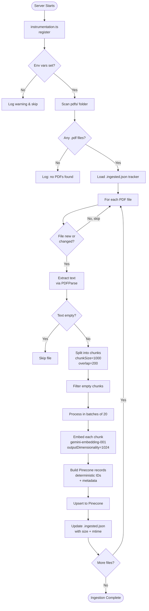

# Document Q&A — RAG System Documentation

A **Retrieval-Augmented Generation (RAG)** application built with Next.js 16,
Google Gemini, and Pinecone. Drop PDFs into a folder, start the server, and
ask questions about them in plain English.

---

## Table of Contents

1. [What is RAG?](#what-is-rag)
2. [Tech Stack](#tech-stack)
3. [Project Structure](#project-structure)
4. [Flow Diagrams](#flow-diagrams)
5. [Ingestion Pipeline](#ingestion-pipeline-detailed)
6. [Query Pipeline](#query-pipeline-detailed)
7. [Key Files](#key-files)
8. [How to Use](#how-to-use)
9. [Environment Variables](#environment-variables)

---

## What is RAG?

Standard AI answers from general training data — it doesn't know *your* documents.
RAG fixes that by:

1. **Storing** your document content as searchable vectors in a database.
2. **Retrieving** only the most relevant pieces when you ask a question.
3. **Generating** an answer grounded in *those specific pieces* — not hallucinated.

---

## Tech Stack

| Layer | Technology |
|---|---|
| Framework | Next.js 16 (App Router, TypeScript) |
| UI | Tailwind CSS v4 |
| Embeddings | Google `gemini-embedding-001` via REST API |
| LLM | Google `gemini-2.5-flash` |
| Vector DB | Pinecone (serverless, 1024 dimensions) |
| PDF Parsing | `pdf-parse` v2 |
| Text Splitting | `@langchain/textsplitters` |

---

## Project Structure

```
emp-rag/
├── pdfs/                          ← Drop your PDFs here
│   └── .ingested.json             ← Auto-generated ingestion tracker
│
├── instrumentation.ts             ← Runs ingestAllPdfs() on server start
│
├── app/
│   ├── lib/
│   │   ├── ingestPdfs.ts          ← Full ingestion logic
│   │   └── geminiEmbeddings.ts    ← Gemini REST embedding client
│   │
│   ├── api/
│   │   ├── query/route.ts         ← POST /api/query — answers questions
│   │   └── status/route.ts        ← GET  /api/status — lists indexed PDFs
│   │
│   ├── components/
│   │   └── RAGChat.tsx            ← Main UI component
│   │
│   ├── page.tsx                   ← Root page
│   └── layout.tsx
│
├── next.config.ts
└── .env.local                     ← API keys
```

---

## Flow Diagrams

### System Overview

```mermaid
graph TB
    subgraph INPUT["📁 Input"]
        PDF[PDF Files<br/>in pdfs/ folder]
    end

    subgraph INGEST["🔄 Ingestion Pipeline (on server start)"]
        PARSE[Extract Text<br/>pdf-parse v2]
        SPLIT[Split into Chunks<br/>1000 chars / 200 overlap]
        EMBED_I[Generate Embeddings<br/>gemini-embedding-001<br/>→ 1024 numbers]
        STORE[Upsert to Pinecone<br/>with metadata]
    end

    subgraph QUERY["💬 Query Pipeline (on user question)"]
        Q[User Question]
        EMBED_Q[Embed Question<br/>gemini-embedding-001<br/>→ 1024 numbers]
        SEARCH[Similarity Search<br/>Pinecone top-4 matches]
        CONTEXT[Build Context<br/>from chunk text]
        LLM[Generate Answer<br/>gemini-2.5-flash]
        ANS[Friendly Answer<br/>+ Sources]
    end

    subgraph DB["🗄️ Pinecone Vector DB"]
        VEC[(Vectors +<br/>Metadata)]
    end

    PDF --> PARSE --> SPLIT --> EMBED_I --> STORE --> VEC
    Q --> EMBED_Q --> SEARCH
    VEC --> SEARCH --> CONTEXT --> LLM --> ANS
```



---

### Ingestion Flow (Detailed)



---

### Query Flow (Detailed)

```mermaid
flowchart TD
    USER([User types question]) --> API[POST /api/query]
    API --> VALID{Valid question?}
    VALID -- No --> ERR400[Return 400 error]
    VALID -- Yes --> ENV{Env vars set?}
    ENV -- No --> ERR500[Return 500 error]
    ENV -- Yes --> EMB_Q[Embed question<br/>gemini-embedding-001<br/>→ 1024-dim vector]

    EMB_Q --> PC[Query Pinecone<br/>topK=4, includeMetadata=true]
    PC --> MATCHES{Any matches?}
    MATCHES -- None --> NO_DOCS[Return: no content found]
    MATCHES -- Yes --> CTX[Extract chunk text<br/>from metadata<br/>join with separator]

    CTX --> PROMPT[Build prompt<br/>system + context + question]
    PROMPT --> GEMINI[gemini-2.5-flash<br/>temperature=0.7]
    GEMINI --> ANSWER[Generated answer]

    ANSWER --> DEDUP[Deduplicate sources<br/>by filename]
    DEDUP --> RESP[Return JSON<br/>answer + sources + chunk count]
    RESP --> UI([Display in RAGChat UI])
```



---

### Embedding — Text to Numbers

```mermaid
graph LR
    TEXT["'company leave policy'"]
    API["Gemini REST API<br/>gemini-embedding-001<br/>outputDimensionality: 1024"]
    VEC["[0.023, -0.045, 0.112,<br/>..., 0.087]<br/>← 1024 numbers"]

    TEXT --> API --> VEC

    VEC2["Question vector"]
    VEC3["Chunk vector (similar)"]
    VEC4["Chunk vector (different)"]

    style VEC2 fill:#6366f1,color:#fff
    style VEC3 fill:#10b981,color:#fff
    style VEC4 fill:#64748b,color:#fff
```



> **Why numbers?** Pinecone can compare vectors mathematically. Sentences with
> similar *meaning* produce similar vectors — even if they use different words.
> "Annual leave" and "paid time off" will be close in vector space.

---

### Chunk Overlap Explained

```mermaid
graph LR
    subgraph DOC["Full Document Text"]
        C0["Chunk 0<br/>(chars 0–1000)"]
        C1["Chunk 1<br/>(chars 800–1800)"]
        C2["Chunk 2<br/>(chars 1600–2600)"]
    end

    OV1["← 200 char overlap →"]
    OV2["← 200 char overlap →"]

    C0 --- OV1 --- C1 --- OV2 --- C2
```



> **Why overlap?** If a key sentence sits at the boundary of two chunks, the
> 200-character overlap means at least one chunk fully contains it. This prevents
> answers from being lost at chunk borders.

---

### Smart Re-ingestion (Deduplication)

```mermaid
flowchart LR
    PDF[handbook.pdf] --> CHECK{In .ingested.json<br/>with same size + mtime?}
    CHECK -- Yes --> SKIP[Skip — already indexed]
    CHECK -- No/Changed --> INGEST[Re-ingest]
    INGEST --> DET[Deterministic ID:<br/>handbook_pdf-chunk-0<br/>handbook_pdf-chunk-1<br/>...]
    DET --> UPSERT[Pinecone upsert<br/>overwrites same ID]
    UPSERT --> UPDATE[Update tracker]
```



> Re-ingesting uses the same IDs so Pinecone **overwrites** old vectors.
> No duplicates are created.

---

## Ingestion Pipeline (Detailed)

### 1. Server Start → `instrumentation.ts`

Next.js calls `register()` before handling any requests. This is the entry
point that kicks off PDF ingestion.

```ts
export async function register() {
  if (process.env.NEXT_RUNTIME === "nodejs") {
    const { ingestAllPdfs } = await import("./app/lib/ingestPdfs");
    await ingestAllPdfs();
  }
}
```

### 2. Scan & Filter — `ingestPdfs.ts`

- Reads all `.pdf` files from the `pdfs/` directory.
- Compares file size and last-modified timestamp against `.ingested.json`.
- Only processes **new or changed** files.

### 3. PDF Text Extraction

Uses `pdf-parse` v2's class-based API:

```ts
const parser = new PDFParse({ data: new Uint8Array(buffer) });
const { text, total } = await parser.getText();
// text  = full document text as a string
// total = number of pages
```

### 4. Chunking

`RecursiveCharacterTextSplitter` splits text respecting natural boundaries
(paragraphs, sentences) before falling back to character splits:

```
chunkSize:    1000 characters
chunkOverlap: 200  characters
```

### 5. Embedding

Each chunk is sent to Gemini via a direct REST call:

```
POST https://generativelanguage.googleapis.com/v1beta/models/gemini-embedding-001:embedContent
{
  content: { parts: [{ text: chunk }] },
  outputDimensionality: 1024
}
→ { embedding: { values: [1024 numbers] } }
```

### 6. Pinecone Upsert

```ts
await index.upsert([{
  id: "handbook_pdf-chunk-0",   // deterministic
  values: [/* 1024 numbers */],
  metadata: {
    text: "original chunk text",
    source: "handbook.pdf",
    chunkIndex: 0,
    totalChunks: 42,
    ingestedAt: "2026-02-17T..."
  }
}]);
```

---

## Query Pipeline (Detailed)

### 1. Embed the Question

The user's question goes through the **same** embedding model so it lands in
the same vector space as the stored chunks.

### 2. Similarity Search

Pinecone computes **cosine similarity** between the question vector and every
stored vector. Returns the top 4 closest matches.

> Cosine similarity = 1.0 means identical direction (perfect match).
> Cosine similarity = 0.0 means completely unrelated.

### 3. Build Context

The `text` field from each match's metadata is joined into a single context
string separated by `---` dividers.

### 4. Generate Answer

The context + question is sent to `gemini-2.5-flash` with a friendly prompt
that instructs it to:
- Answer only from the provided context
- Use a warm, conversational tone
- Use bullet points for multi-part answers
- Admit when it doesn't know rather than guessing

---

## Key Files

### `app/lib/geminiEmbeddings.ts`

Custom embedding class that calls the Gemini REST API directly. It was
written from scratch because the official `@langchain/google-genai` wrapper
silently swallows API errors (returning empty `[]` vectors) and doesn't
support `outputDimensionality`.

### `app/lib/ingestPdfs.ts`

All ingestion logic in one place — scanning, parsing, chunking, embedding,
upserting, and tracking. Re-used by `instrumentation.ts` at startup.

### `app/api/query/route.ts`

Stateless API handler. No database reads beyond Pinecone. Each request is
independent: embed → search → generate → respond.

### `app/api/status/route.ts`

Reads `pdfs/` on disk and `.ingested.json`, merges them, and returns a status
list that the UI uses to show which documents are Ready vs Pending.

---

## How to Use

### Initial Setup

```bash
# 1. Install dependencies
npm install

# 2. Fill in your API keys
# Edit .env.local with your GOOGLE_API_KEY and PINECONE_API_KEY

# 3. Add PDFs
cp your-documents/*.pdf pdfs/

# 4. Start the server
npm run dev
# → Server starts, PDFs are auto-ingested, check terminal for progress
```

### Terminal output during ingestion

```
[RAG] Ingesting 2 PDF(s)...
[RAG] ▶ Processing: employee-handbook.pdf
[RAG] ✓ employee-handbook.pdf: 42 chunks across 5 page(s)
[RAG] ▶ Processing: company-policy.pdf
[RAG] ✓ company-policy.pdf: 18 chunks across 2 page(s)
[RAG] Ingestion complete.
```

### Adding more PDFs

```bash
cp new-document.pdf pdfs/
# Then restart the server — only the new file will be ingested
```

### Resetting / re-ingesting everything

```bash
# Delete the tracker to force full re-ingest on next start
rm pdfs/.ingested.json
npm run dev
```

---

## Environment Variables

| Variable | Where to get it | Description |
|---|---|---|
| `GOOGLE_API_KEY` | [aistudio.google.com](https://aistudio.google.com/app/apikey) | Used for embeddings and LLM |
| `PINECONE_API_KEY` | [app.pinecone.io](https://app.pinecone.io/) | Vector database auth |
| `PINECONE_INDEX` | Pinecone dashboard | Index **name** only (e.g. `emp-rag`) |

> **Pinecone index settings:** Create with **1024 dimensions** and
> **cosine** metric to match `gemini-embedding-001` with `outputDimensionality: 1024`.

---

## Common Issues

| Error | Cause | Fix |
|---|---|---|
| `Vector dimension 0` | Embedding API call failed silently | Check `GOOGLE_API_KEY` is valid |
| `Must pass at least 1 record` | Pinecone SDK version mismatch | Use `@pinecone-database/pinecone@^5` |
| `Failed to parse PDF` | pdf-parse v2 class API not used | Use `new PDFParse({ data: Uint8Array })` |
| PDFs not ingested on restart | Files unchanged (same size + mtime) | Delete `pdfs/.ingested.json` to force re-ingest |
| `DOMMatrix is not defined` | pdfjs-dist bundled by Next.js | Add `pdf-parse` to `serverExternalPackages` |
